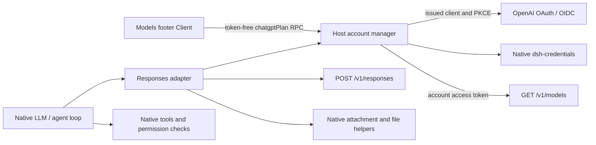

# Architecture

The **Adapter** pattern connects the Harness's provider-neutral LLM contract to OpenAI Responses. The model API is Responses itself; no Chat Completions request, Codex backend, Codex OAuth client identifier, or intermediary inference server is involved.

## Ownership

- `src/oauth.ts` owns dynamic registration, fresh PKCE/state/nonce, loopback callback, JOSE OIDC verification, token exchange/rotation and revocation. Discovery and key endpoints stay on the trusted OpenAI issuer origin.
- `src/session.ts` owns the credential schema, stable installation UUIDv4 URN (`urn:uuid:...`), canonical profile identity, one active token set, refresh serialization, account generation guards and catalog publication. Account registration metadata survives sign-out. An early development bare UUID is normalized without changing the UUID.
- `src/models.ts` preserves account catalog visibility/order/identifiers and combines its metadata with a small dated official capability baseline. Unknown capabilities are explained rather than invented.
- `src/request.ts` projects full native history and the current tool declarations into Responses. Tool names use a deterministic collision-resistant mapping. The native filesystem/attachment helpers retain file handles, readonly image paths and offload markers.
- `src/response-stream.ts` turns Responses SSE events into native blocks, deltas, usage and one terminal finish. Only `response.completed` is success. It never executes a tool.
- `src/adapter.ts` owns the official OpenAI SDK request, with `maxRetries: 0`, `store: false`, streaming, native attribution headers and safe provider failure routing. Harness decides retries.
- `src/service.ts` publishes five `chatgptPlan` methods: `getStatus`, cancelable streaming `authorize`, `cancel`, `disconnect`, and `refreshModels`. Public results contain no OAuth token values. The official account catalog is the only model source; refresh replaces the cached visible entries without appending omitted identifiers.
- `src/client/` owns the Models footer, sidebar connection notice, account/model state and sign-in controls. It mounts its generated Remote contribution and receives state through native UI observable hooks. Both surfaces share one token-free connection observable; no quota polling or second authentication flow is introduced.

The sidebar notice registers an additive `sidebar.footer.action` entry. On the pinned rc.2 shell this area precedes `sidebar.settings`, preserving the DeepSeek account launcher. The notice shows only a connected plan or a reconnect-required state, never an inferred quota or a claim that the selected model uses ChatGPT. Its usage link opens the official ChatGPT dashboard without credentials in the URL. A scoped wrapping rule gives the notice its own footer row alongside existing actions; the collapsed rail uses a compact, accessible text link. Reconnection remains in Models. The official sidebar package is a development-only type dependency.

The Client entry mounts its Remote contribution first, then starts an injected child context that declares `remote.chatgptPlan` alongside `remote` and `slots`. The pinned Gateway requires callers to declare their concrete namespace. Declaring that namespace in the entry before mounting it would create a startup dependency cycle. The panel repulls state when opened and on native connection resets.

## Credentials and races

Credentials remain in the native managed store, normally `$DSH_HOME/.credentials.yaml`, whose file implementation writes with owner-only permissions. It is a native managed file, not an OS-keychain claim. The plugin derives its record key from the canonical profile directory's SHA-256 digest; installation identity has its own record.

Refresh uses the native `modifyRecord` cross-process lock around read, refresh and complete replacement. Once rotation starts it is persisted even if that request's consumer cancels. Disconnect cancels active requests, waits for any refresh, revokes the latest token set, and removes tokens atomically. A changed account generation rejects stale prepared calls and catalog responses. Native credential events republish the provider and cancel calls when another process changes the account.

Reasoning replay contains opaque provider reasoning data, not authentication credentials. Its account client ID, exact model and per-block fingerprints prevent replay across accounts/models or rewritten history. It is persisted through the native assistant replay envelope and is resent with full history because Responses storage is disabled.

Explicit native `options.system` keeps precedence for `instructions`; otherwise a leading system-history message supplies it. Every other system-history message is preserved at its original position as a Responses developer message, as required by the preview. No historical system message overwrites or drops another.

Cancellation waits for callback/token cleanup. An exchanged grant that was not activated is revoked; issued registration metadata remains available for reconnection. Once a validated session has been atomically activated, cancelling catalog loading leaves that session connected; use Disconnect to revoke it.

The adapter uses the native aspect-preserving `requestImageDimensions` helper and the pinned native adapter defaults: a 2048 × 2048 total-pixel budget, 1 MiB encoded target per request version and 20 MiB aggregate base64 bound. These are local policies, not asserted OpenAI API limits. `requiredImageOffload` counts exact request-byte occurrences and returns the native `IMAGE_OFFLOAD_REQUIRED` failure so the Harness applies its durable offload/retry flow. Repeated images are normalized once but counted per occurrence.

Output items must keep consistent identities and complete successfully. The live plan-sharing route can send `response.completed` with `output: []` after closing every item with `response.output_item.done`; the adapter uses that validated item ledger. An open item, reused output index or contradictory nonempty final aggregate is rejected. The terminal completion event remains mandatory before any tool-call turn succeeds. HTTP status and Retry-After are retained only when observed; network and SSE failures do not invent HTTP status codes. Redirects are rejected for authenticated provider requests.

## Build and distribution

The workspace contains one distributable package at `packages/plugin`. Host TypeScript builds before the Client, then tsdown emits the Host and native lazy-CJS Client. The official Typert generator produces `./typert` and `./remote`; `./types` exposes token-free DTOs.

The rc.2 analyzer recognizes protocol symbols only in registered source projects. `scripts/prepare-typert.mjs` creates an analysis-only project from the exact installed public protocol declarations. This does not patch a dependency or ship another protocol runtime. The generated view is excluded from distribution; native generator workspace mode emits only explicit contract exporters.

Bundling the browser codec keeps the Client compatible with the existing lazy module loader. Harness and Cordis packages remain peer dependencies; the official SDK, JOSE and Zod are runtime dependencies. The MIT source workspace and npm tarball are delivered locally; no registry publication occurs.

A fork of the installed Harness would provide broader control but require carrying application changes. A native plugin preserves the installed application's update path and gives each component a small responsibility boundary. This conventional plugin seam is reversible and does not require an ADR.
